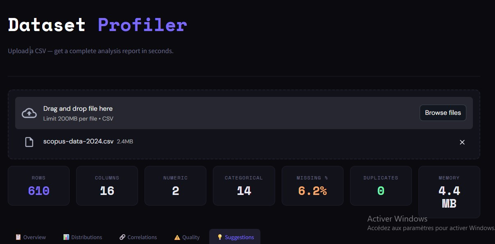
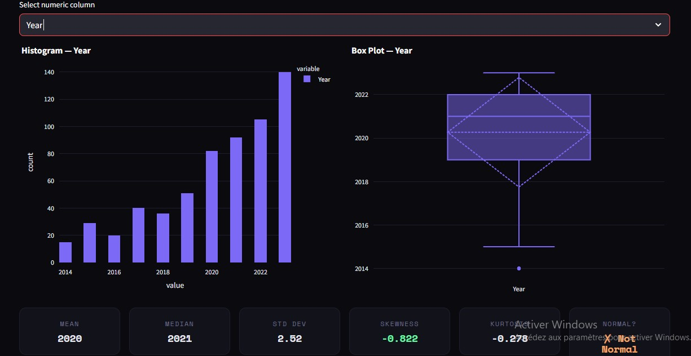
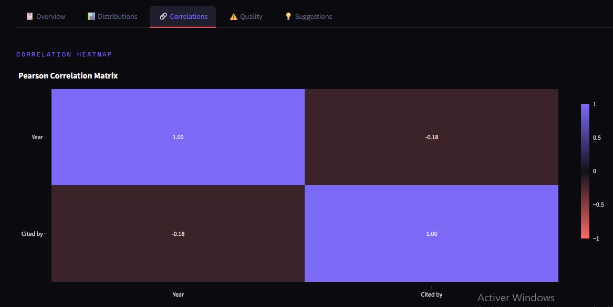
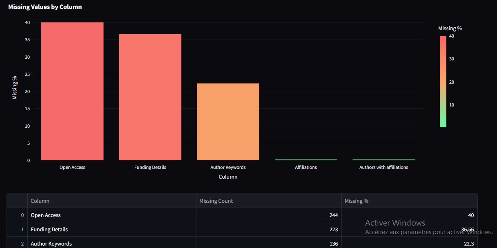
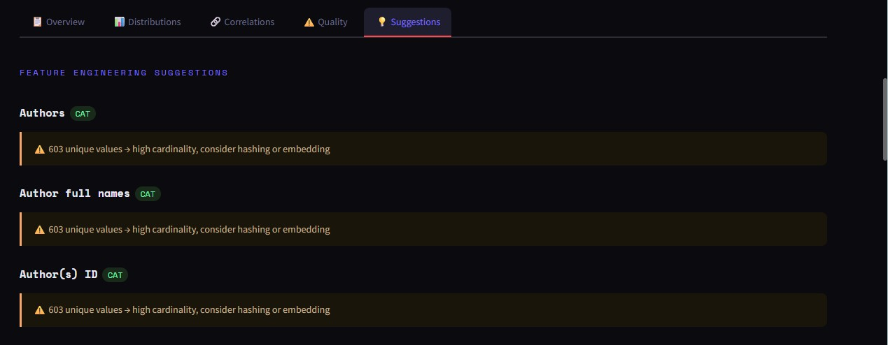

# 🔬 Dataset Profiler — DataLens

> **Analyse automatique de datasets CSV en quelques secondes.**
> Upload un fichier → rapport complet, zéro configuration.

---

## 📌 Table des matières

1. [Présentation](#présentation)
2. [Demo live](#demo-live)
3. [Stack technique](#stack-technique)
4. [Architecture du projet](#architecture-du-projet)
5. [Fonctionnalités détaillées](#fonctionnalités-détaillées)
   - [Landing Page & Upload](#1--landing-page--upload)
   - [Metric Cards](#2--metric-cards)
   - [Onglet Overview](#3--onglet-overview)
   - [Onglet Distributions](#4--onglet-distributions)
   - [Onglet Correlations](#5--onglet-correlations)
   - [Onglet Quality](#6--onglet-quality)
   - [Onglet Suggestions](#7--onglet-suggestions)
6. [Fonctions utilitaires](#fonctions-utilitaires)
7. [Design system](#design-system)
8. [Installation & lancement local](#installation--lancement-local)
9. [Déploiement Streamlit Cloud](#déploiement-streamlit-cloud)
10. [Datasets de test recommandés](#datasets-de-test-recommandés)
11. [Checklist de validation](#checklist-de-validation)

---

## Présentation

**Dataset Profiler** est une application web légère construite avec **Streamlit**.
Elle permet à n'importe quel utilisateur — data scientist, analyste, étudiant —
d'uploader un fichier CSV et d'obtenir instantanément :

- Un **résumé global** du dataset (dimensions, mémoire, qualité)
- L'**analyse colonne par colonne** (stats, distribution, valeurs manquantes)
- Une **heatmap de corrélations** entre variables numériques
- Un **rapport qualité** (outliers, doublons, colonnes constantes)
- Des **suggestions de feature engineering** automatiques et personnalisées

L'outil est pensé pour être **zéro friction** : pas de configuration, pas de login,
rien ne quitte le navigateur de l'utilisateur.

---

## Demo live

> 🚀 **[https://datasetprofiler.streamlit.app/](#)** 

---

## Stack technique

| Outil | Version | Rôle |
|---|---|---|
| **Python** | 3.10+ | Langage principal |
| **Streamlit** | ≥ 1.32 | Interface web & widgets |
| **Pandas** | ≥ 2.0 | Manipulation des données |
| **NumPy** | ≥ 1.24 | Calculs numériques |
| **Plotly** | ≥ 5.18 | Graphiques interactifs |
| **Scipy** | ≥ 1.11 | Test de normalité (`normaltest`) |

---

## Architecture du projet

```
dataset-profiler/
├── app.py              # Application complète (fichier unique, ~770 lignes)
├── requirements.txt    # Dépendances pip
├── README.md           # Ce fichier
└── results/            # Captures d'écran de l'interface
    ├── landing_page.jpg
    ├── distribution.jpg
    ├── correlation.jpg
    ├── quality.jpg
    └── suggestion.jpg
```

> Tout le code tient dans un seul fichier `app.py` — aucun module externe maison,
> aucune base de données, aucun backend.

---

## Fonctionnalités détaillées

---

### 1 — Landing Page & Upload



> **Ce que l'on voit ici :**
> L'utilisateur a uploadé le fichier `scopus-data-2024.csv` (2.4 MB).
> Les **7 metric cards** se sont immédiatement remplies :
> - **610 lignes** (en violet — couleur accent principale)
> - **16 colonnes** dont 2 numériques et 14 catégorielles
> - **6.2% de valeurs manquantes** → affiché en orange (seuil entre 5% et 20%)
> - **0 doublon** → affiché en vert (parfait)
> - **4.4 MB** en mémoire
>
> En bas, les **5 onglets de navigation** sont visibles.
> L'onglet actif ici est "Suggestions" (en surbrillance).

**Comportement de la zone d'upload :**
- Drag & drop ou clic "Browse files"
- Accepte uniquement les fichiers `.csv`
- Limite : 200 MB par fichier (limite Streamlit Cloud)
- Le chargement est mis en cache (`@st.cache_data`) — re-uploader le même fichier
  ne recharge pas les données inutilement

**État vide (avant upload) :**
```
📂
Drop a CSV file above to start profiling
Supports any structured CSV · Nothing leaves your browser
```

---

### 2 — Metric Cards

Les 7 cartes affichées au-dessus des onglets donnent une **vue d'ensemble instantanée**.
Chaque carte a une couleur conditionnelle :

| Carte | Calcul | Couleur |
|---|---|---|
| **Rows** | `len(df)` | Violet accent `#7c6af7` |
| **Columns** | `len(df.columns)` | Blanc neutre |
| **Numeric** | nb colonnes numériques | Blanc neutre |
| **Categorical** | nb colonnes catégorielles | Blanc neutre |
| **Missing %** | nulls totaux / taille × 100 | Vert < 5% · Orange < 20% · Rouge sinon |
| **Duplicates** | `df.duplicated().sum()` | Vert si 0 · Orange < 5% · Rouge sinon |
| **Memory** | `df.memory_usage(deep=True).sum()` | Blanc neutre |

---

### 3 — Onglet Overview

> *(pas de capture séparée — visible en arrière-plan sur la landing page)*

Cet onglet affiche deux sections :

**A) Column Summary**
Pour chaque colonne, une carte affiche :
- Le **nom** de la colonne (police monospace Space Mono)
- Un **badge coloré** selon le type sémantique détecté :
  - `NUM` → fond violet sombre / texte violet
  - `CAT` → fond vert sombre / texte vert
  - `DATE` → fond orange sombre / texte orange
  - `BOOL` → fond jaune sombre / texte jaune
- Le **pourcentage de nulls** (vert / orange / rouge selon seuil)
- Un **résumé en une ligne** selon le type :
  - Numérique : `mean=X · std=X · min=X · max=X`
  - Catégoriel : `N unique · top='valeur_la_plus_fréquente'`
  - Datetime : `range: date_min → date_max`
  - Bool : `values: [True, False]`

**B) Sample Data**
Les 10 premières lignes du dataset dans un tableau interactif Streamlit.

---

### 4 — Onglet Distributions



> **Ce que l'on voit ici :**
> La colonne numérique **Year** est analysée sur le dataset Scopus 2024.
>
> **Histogramme (gauche) :** La distribution montre une **croissance régulière des publications** de 2014 à 2023, avec un pic en 2023 (~140 publications). Les barres sont en violet sans bordure.
>
> **Box Plot (droite) :** La boîte IQR s'étend de ~2019 à ~2022. Un **outlier isolé** apparaît vers 2014 (point en bas). La ligne pointillée représente la moyenne, la ligne pleine la médiane.
>
> **Metric cards statistiques (bas) :**
> - `Mean = 2020` — moyenne des années de publication
> - `Median = 2021` — la médiane légèrement supérieure indique une queue gauche
> - `Std Dev = 2.52` — faible dispersion (données sur ~10 ans)
> - `Skewness = -0.822` → **affiché en orange** car `|skew| > 1` → distribution asymétrique vers la gauche (queue de vieilles publications)
> - `Kurtosis = -0.278` — distribution légèrement aplatie
> - `Normal? = ✗ Not Normal` → **affiché en orange** car le test de normalité (scipy `normaltest`) rejette H0

**Sous-section numérique — 6 stat cards :**

| Stat | Calcul |
|---|---|
| Mean | `series.mean()` |
| Median | `series.median()` |
| Std Dev | `series.std()` |
| Skewness | `series.skew()` → orange si `abs > 1` |
| Kurtosis | `series.kurtosis()` |
| Normal? | `scipy.stats.normaltest(p > 0.05)` → vert ✓ / orange ✗ |

**Sous-section catégorielle :**
- Sélecteur de colonne catégorielle
- Bar chart horizontal (top 20 valeurs) en vert néon
- Donut chart (pie avec `hole=0.4`) pour la répartition

---

### 5 — Onglet Correlations



> **Ce que l'on voit ici :**
> La matrice de corrélation de **Pearson** entre les 2 colonnes numériques du dataset :
> `Year` et `Cited by`.
>
> **Lecture de la heatmap :**
> - Diagonale = **1.00** (corrélation parfaite avec soi-même) → violet intense
> - `Year` ↔ `Cited by` = **-0.18** → fond sombre quasi neutre (très faible corrélation négative)
>   - Interprétation : les publications plus récentes ont tendance à être légèrement **moins citées**, ce qui est logique (les articles récents ont eu moins de temps pour accumuler des citations)
>
> **Échelle de couleurs :**
> - `-1` → Rouge `#f76a6a` (corrélation négative forte)
> - `0` → Fond sombre `#12121a` (aucune corrélation)
> - `+1` → Violet `#7c6af7` (corrélation positive forte)

**Trois sous-sections dans cet onglet :**

1. **Heatmap** — Matrice de Pearson complète avec valeurs dans chaque cellule
2. **Top corrélations** — Tableau trié par valeur absolue décroissante (15 premières paires)
3. **Scatter Explorer** — Deux selectbox X/Y + scatter plot avec droite de régression OLS

> Si le dataset contient moins de 2 colonnes numériques, un message
> `Need at least 2 numeric columns` est affiché à la place.

---

### 6 — Onglet Quality



> **Ce que l'on voit ici :**
> Le rapport de qualité des données du dataset Scopus 2024.
>
> **Bar chart "Missing Values by Column" :**
> Trois colonnes ont des valeurs manquantes significatives :
> - `Open Access` : **40%** de nulls → barre rouge (critique)
> - `Funding Details` : **36.56%** → barre rouge
> - `Author Keywords` : **22.3%** → barre orange (attention)
> - `Affiliations` et `Authors with affiliations` : < 1% → barres vertes (acceptable)
>
> Le gradient vert → orange → rouge est immédiatement lisible.
>
> **Tableau récapitulatif (bas) :**
> Chaque ligne détaille : nom de la colonne, nombre exact de nulls, pourcentage.
> Trié par % décroissant pour prioriser l'attention.

**Quatre sous-sections dans cet onglet :**

**A) Valeurs manquantes**
- Si 0 null : `✅ No missing values — your dataset is complete!`
- Sinon : bar chart coloré + tableau `Column | Missing Count | Missing %`

**B) Doublons**
- Si 0 doublon : `✅ No duplicate rows found.`
- Sinon : warning box + checkbox optionnelle "Show duplicate rows"
  (affiche jusqu'à 50 lignes dupliquées)

**C) Outliers (méthode IQR)**
```
Q1 = 25ème percentile
Q3 = 75ème percentile
IQR = Q3 - Q1
Outlier si valeur < Q1 - 1.5×IQR  OU  valeur > Q3 + 1.5×IQR
```
- Bar chart gradient jaune → orange → rouge par colonne
- Si aucun outlier : `✅ No significant outliers detected.`

**D) Colonnes constantes / quasi-constantes**
- `🔴 col` — 1 unique value → colonne inutile, à supprimer
- `🟡 col` — < 1% de valeurs uniques sur une colonne numérique → quasi-constante

---

### 7 — Onglet Suggestions



> **Ce que l'on voit ici :**
> Les suggestions de feature engineering pour les colonnes catégorielles
> `Authors`, `Author full names` et `Author(s) ID`.
>
> Toutes les trois ont le badge **CAT** (vert).
> Chaque colonne déclenche la règle "haute cardinalité" :
> **603 valeurs uniques** → la règle `nuniq > 50` s'applique et recommande
> du **hashing ou de l'embedding** plutôt qu'un One-Hot Encoding
> (qui créerait 603 colonnes binaires — ingérable).
>
> Les boîtes orangées (`warn-box`) signalent un **problème à traiter**
> avant l'entraînement d'un modèle. Les boîtes bleues (`suggestion`)
> indiquent une **opportunité d'amélioration**.

**Logique des règles par type de colonne :**

**Colonnes numériques :**
| Condition | Suggestion |
|---|---|
| `abs(skew) > 1` | `💡 Skewness élevée → log1p ou Box-Cox` |
| `outliers > 5%` | `⚠️ Nombreux outliers → capping/winsorizing` |
| `nuniq / len < 5%` | `💡 Faible cardinalité → traiter comme catégoriel` |
| `nulls > 0` | `🔧 Imputer avec médiane (skewed) ou moyenne (normal)` |

**Colonnes catégorielles :**
| Condition | Suggestion |
|---|---|
| `nuniq == 2` | `💡 Binaire → Label Encoding (0/1) suffisant` |
| `nuniq ≤ 10` | `💡 One-Hot Encoding recommandé` |
| `nuniq ≤ 50` | `💡 Target Encoding ou Frequency Encoding` |
| `nuniq > 50` | `⚠️ Haute cardinalité → hashing ou embedding` |
| `top value > 90%` | `⚠️ Colonne déséquilibrée → peu informative` |
| `nulls > 0` | `🔧 Imputer avec mode ou ajouter 'Unknown'` |

**Colonnes datetime :**
- `💡 Extraire year, month, day, weekday, hour`
- `💡 Calculer le temps écoulé depuis une date de référence`

**Recommandations globales (toujours affichées) :**
- Si `missing % > 20%` → suggère `IterativeImputer`
- Si doublons > 0 → suggère `df.drop_duplicates()`
- Si paires corrélées > 0.95 → alerte multicolinéarité
- Universelles : `StandardScaler`, `stratify=y`, `SHAP`

---

## Fonctions utilitaires

```python
classify_column(series) -> str
# Détecte le type sémantique : "numeric" | "categorical" | "datetime" | "bool"

detect_outliers_iqr(series) -> tuple[int, int]
# Retourne (nb_outliers, nb_valeurs_non_nulles) via méthode IQR

suggest_features(col_name, series, col_type) -> list[str]
# Génère les suggestions de feature engineering pour une colonne

memory_usage(df) -> str
# Retourne "1.2 MB" | "340 KB" | "892 B"

format_number(n) -> str
# 1234567 → "1,234,567" | 0.00312 → "0.00312" | 1234.5 → "1,234.50"
```

---

## Design system

| Élément | Valeur |
|---|---|
| Fond principal | `#0a0a0f` (quasi noir) |
| Accent principal | `#7c6af7` (violet électrique) |
| Succès | `#6af7a7` (vert néon) |
| Warning | `#f7a76a` (orange) |
| Danger | `#f76a6a` (rouge) |
| Texte principal | `#e8e8f0` |
| Texte secondaire | `#6b6b8a` |
| Cards / panels | `#12121a` avec bordure `#1e1e2e` |
| Police titres | Space Mono (Google Fonts) — monospace |
| Police corps | DM Sans (Google Fonts) — moderne |

Tous les graphiques Plotly ont :
```python
paper_bgcolor = "rgba(0,0,0,0)"   # fond transparent
plot_bgcolor  = "rgba(0,0,0,0)"   # fond transparent
font_color    = "#9090b0"
colorway      = ["#7c6af7", "#6af7a7", "#f7a76a", "#f76a6a", "#6ad4f7"]
```

---

## Installation & lancement local

### Prérequis
- Python 3.10 ou supérieur
- pip

### Étapes

```bash
# 1. Cloner le repo
git clone https://github.com/ton-user/dataset-profiler.git
cd dataset-profiler

# 2. (Optionnel) Créer un environnement virtuel
python -m venv venv
source venv/bin/activate        # Linux / macOS
venv\Scripts\activate           # Windows

# 3. Installer les dépendances
pip install -r requirements.txt

# 4. Lancer l'application
streamlit run app.py
```

L'app s'ouvre automatiquement sur `http://localhost:8501`

---

## Déploiement Streamlit Cloud

1. **Pusher le repo** sur GitHub (public ou privé)
2. Aller sur [share.streamlit.io](https://share.streamlit.io)
3. Cliquer **"New app"**
4. Sélectionner le repo → branche `main` → fichier `app.py`
5. Cliquer **"Deploy"**

> L'URL publique est disponible en ~2 minutes.
> Le déploiement est **gratuit** pour les repos publics.

---

## Datasets de test recommandés

| Dataset | Source | Intérêt |
|---|---|---|
| **Titanic** | [Kaggle](https://www.kaggle.com/c/titanic) | Colonnes mixtes, valeurs manquantes, variable binaire |
| **Iris** | `sklearn.datasets` | Colonnes numériques propres, corrélations fortes |
| **House Prices** | [Kaggle](https://www.kaggle.com/c/house-prices-advanced-regression-techniques) | Haute cardinalité, skewness, outliers |
| **Scopus 2024** | Export Scopus CSV | Données réelles académiques, beaucoup de nulls |

---

## Checklist de validation

- [x] L'app se lance avec `streamlit run app.py` sans erreur
- [x] L'upload fonctionne avec n'importe quel CSV valide
- [x] Les 5 onglets s'affichent correctement
- [x] Les graphiques Plotly ont le fond transparent (pas blanc)
- [x] Les metric cards changent de couleur selon les seuils définis
- [x] Les suggestions s'adaptent à chaque colonne (pas les mêmes pour tous)
- [x] L'app ne plante pas sur un CSV avec 100% de valeurs manquantes
- [x] L'app ne plante pas sur un CSV avec une seule colonne
- [x] L'app ne plante pas sur un CSV avec des colonnes datetime
- [x] Le `@st.cache_data` est en place pour éviter les rechargements
- [ ] Déployée sur Streamlit Cloud avec une URL publique

---

## Auteur

Projet construit avec **Streamlit** · Analyse automatique de données CSV

> *"Upload a CSV — get a complete analysis report in seconds."*
